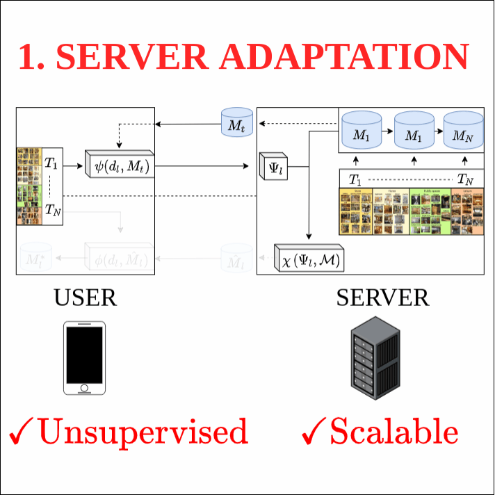

# Dual User-Adaptation (DUA) framework
Source code for CVPR2020 paper ["Unsupervised Model Personalization while Preserving Privacy and Scalability: An Open Problem."](https://arxiv.org/abs/2003.13296)


**In short:** Personalization of models to local user images is prone to three main problems: scalability towards thousands of users, retaining user-privacy, and labeling local user data. Our Dual User-Adaptation framework (DUA) unveils a novel perspective to tackle all of these practical concerns and enables personalization on both the server and local user edge-device.
The code simulates the server and users, and provides 3 benchmarks to evaluate the efficacy of our DUA framework.



**Keywords:** Model Personalization, User Adaptation, Continual Learning, Domain Adaptation, Privacy, Scalability, Unsupervised Learning


## Running the code
Always execute the scripts from within the *"exp/"* directory.
- *exp/demo_script.sh*: Run demo pipeline for MAS-RACL and FIM-IMM baseline.
- *config.init*: Adapt where to store your datasets, models and results to external paths.
- *requirements.txt*: Install the required packages for this code.
        ```
                pip install -r requirements.txt
        ```

To reproduce the results from our paper:
- *exp/exps_Scenes.sh*: Setups to reproduce results for the MIT Indoor Scenes based dataset.
- *exp/exps_Numbers.sh*: Setups to reproduce results for the MNIST-SVHN based Numbers dataset.

## Reference Results
Results obtained in paper: average accuracy (forgetting).

1. RACL results (see *exp/exps_Scenes.sh* and *exp/exps_Numbers.sh* to replicate results)

    |          | Alexnet        |                 | VGG11          |                 | MLP         |
    |----------|----------------|-----------------|----------------|-----------------|---------------|
    | Method   | Category Prior | Transform Prior | Category Prior | Transform Prior | Numbers       |
    | MAS-RACL | 66.97 (0.88)   | 47.04 (-0.27)   | 77.32 (0.77)   | 53.59 (-0.14)   | 84.01 (-0.22) |
    | FIM-RACL | 67.20 (0.73)   | 47.32 (-0.51)   | 76.53 (0.68)   | 53.73 (-0.13)   | 87.83 (0.30)  |
    | MAS-IMM  | 67.39 (0.73)   | 46.51 (-0.14)   | 76.77 (0.30)   | 53.49 (-0.17)   | 84.36 (-0.40) |
    | FIM-IMM  | 67.42 (0.23)   | 46.68 (-0.35)   | 76.29 (0.43)   | 53.14 (0.07)    | 87.68 (0.07)  |

2. AdaBN/AdaBN-S results (see *exp/exps_Scenes.sh* to replicate results)

    |               |              | CatPrior      |               |               | TransPrior    |              |              |
    |---------------|--------------|---------------|---------------|---------------|---------------|--------------|--------------|
    |               | Method       | BN            | AdaBN         | AdaBN-S       | BN            | AdaBN        | AdaBN-S      |
    | User-Specific | MAS-LACL     | 58.05 (2.74)  | 58.30 (2.34)  | 60.68 (2.67)  | 30.14 (2.69)  | 30.19 (2.50) | 32.82 (3.25) |
    |               | FIM-LACL     | 59.58 (2.14)  | 59.71 (1.61)  | 62.43 (1.84)  | 32.15 (1.53)  | 32.04 (1.33) | 34.80 (2.13) |
    |               | Task Experts | 80.78 (5.61)  | n/a           | n/a           | 68.22 (11.35) | n/a          | n/a          |
    | User-Agnostic | MAS-IMM      | 55.55 (2.69)  | 55.89 (2.69)  | 58.87 (2.81)  | 29.36 (2.63)  | 29.15 (2.45) | 31.73 (3.22) |
    |               | FIM-IMM      | 61.50 (-0.03) | 61.35 (-0.46) | 63.99 (-0.16) | 32.08 (1.32)  | 31.86 (1.21) | 34.48 (2.05) |
    |               | MAS          | 65.58 (3.96)  | 64.15 (4.04)  | 67.10 (4.66)  | 37.32 (2.64)  | 35.64 (2.88) | 40.51 (2.69) |
    |               | EWC          | 66.20 (2.88)  | 64.03 (3.43)  | 67.54 (3.90)  | 37.16 (2.85)  | 35.44 (3.12) | 40.05 (3.18) |
    |               | LWF          | 70.76 (0.73)  | 70.37 (0.43)  | 72.73 (1.03)  | 40.22 (0.43)  | 39.51 (0.12) | 43.07 (0.52) |
    |               | Joint        | 75.75 (n/a)   | 72.13 (n/a)   | 76.39 (n/a)   | 46.53 (n/a)   | 41.18 (n/a)  | 48.50 (n/a)  |
    
## Citing and License
Using this code for your research? Consider citing our work:
```
@article{de2020unsupervised,
  title={Unsupervised Model Personalization while Preserving Privacy and Scalability: An Open Problem},
  author={De Lange, Matthias and Jia, Xu and Parisot, Sarah and Leonardis, Ales and Slabaugh, Gregory and Tuytelaars, Tinne},
  journal={arXiv preprint arXiv:2003.13296},
  year={2020}
}
```

This source code is released under a Attribution-NonCommercial-ShareAlike 4.0 International
license, find out more about it in the [LICENSE file](LICENSE).

Copyright by Matthias De Lange.

